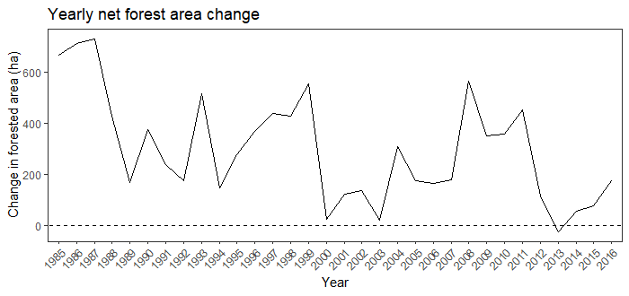
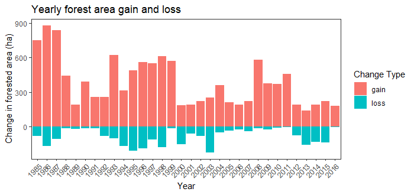

```{r setup, include=FALSE}
knitr::opts_chunk$set(echo = TRUE)
```

# Lab Instructions

Complete the following questions, including all R code used and written answers (boxes for your answers are already defined below). Submit your markdown file on Canvas, in PDF format, by the due date posted online. 

## Attaching packages

This lab requires the following packages to be installed and attached. 

```{r, message=FALSE}
# Spatial Data
library(terra)
library(sf)

# Tidyverse
library(readr)
library(stringr)
library(lubridate)
library(dplyr)
library(tidyr)
library(ggplot2)

# BFAST

library(bfast)
```

# PART 1 - MODIS NDVI time-series analysis

The first part of this lab will focus on an area located in the region of Yellowhead Country, Alberta. We will examine a time series of NDVI values from the MOD13Q1 MODIS product, as we have done during the lecture. 

---

This lab uses NDVI Data from the MODIS Terra product MOD13Q1. Navigate to the following website to read about the product:

https://lpdaac.usgs.gov/products/mod13q1v006/ 

List the following information about the dataset: 

- spatial resolution
- temporal resolution 
- temporal availability  (how far back does it go? Is it still distributed?)
- valid range of NDVI values (1st layer in dataset)

---

### Written Answer

Spatial resolution :  250 Meters
Temporal resolution : 16 day composites
Temporal availability: For Collection 6.1, data from 2000-02-18 onward (and continuing) for the Terra product. 
Version 6  was decommissioned on 31 July 2023
valid range of NDVI values : The MOD13Q1 NDVI layer uses a scaled integer range of –0.2 to +1.0
---

The time series of cleaned MOD13Q1 NDVI layers is located in the `"data/MOD13Q1_TS"` directory. List all the tif files located in this directory using the `list.files` function and the argument `pattern = "tif$"`. The `$` indicates that the file name should **end** with `"tif"` and that the other files containing `"tif"` within their file name will not be listed.

The date of the time series is indicated in the file name a sequence of 7 numbers after the letter `A`. The first four numbers indicate the year and the next three numbers indicate the day of the year. Extract the sequence of 7 numbers indicating the date in a vector of characters called `date_ts`. Convert `date_ts` to an object of class `Date` using the `lubridate::as_date()` function and the argument `format`. 

Create a data.frame with a single column storing the `Dates` vector `date_ts`. Use `dplyr` and `lubridate` to create a new column storing the year corresponding to each date and summarize the number of files per year. 

**- What is the range of years covered by the time series?** 

**- How many files per year?**

---
```{r}
setwd("C:/Users/achisale.stu/Documents/MGEM/GEM 520/Labs/Lab 7/Lab7_data (1)/data/MOD13Q1_TS")
```


### Code answer

```{r}

flist <- list.files("data/MOD13Q1_TS",
                    pattern = "tif$",
                    full.names = TRUE)

fname <- basename(flist)

date_ts <- str_extract(fname, "A[0-9]{7}")

date_ts <- str_replace(date_ts, "A", "")

Dates <- as_date(date_ts, format = "%Y%j")

df_dates <- data.frame(Dates = Dates) %>%    
  mutate(Year = year(Dates)) %>%            
  group_by(Year) %>%                      
  summarise(n_files = n())

df_dates
```


### Written answer

The range is from 2001 to 2020
23 files per year

---

Open the files of `flist` in a `SpatRaster` object called `ndvi_ts` and rename the layers of `ndvi_ts` based on `date_ts`. 


Calculate  the median (`median`) NDVI value of each pixel throughout the entire time-series in a `SpatRaster` object called `ndvi_ts_med`. Include a plot of `ndvi_ts_med` in your report.

---

### Code answer

```{r}
ndvi_ts <- rast(flist)

names(ndvi_ts) <- date_ts
ndvi_ts

ndvi_ts_med <- app(ndvi_ts, 
                   fun="median", 
                   na.rm = TRUE)
plot(ndvi_ts_med)
```


---

We are going to focus on two regions of interest (ROIs) located in the study area. The ROIs are stored in the shapefile `MOD13Q1_roi.shp` located in the `data` folder. Open the shapefile. It uses the same CRS as the MOD13Q1 time series. The `MOD13Q1_roi.shp` has a field called `ID` with the value `A` for the first ROI and `B` for the second `ROI`. 

Extract the average NDVI value of each ROI for each layer of `ndvi_ts` time series into a `data.frame` named `ndvi_roi`. Transform  `ndvi_roi` to a data.frame in a "long" format (one column storing the layer names and another one storing NDVI) named `ndvi_roi_long`.

Using `ndvi_roi_long` and `dplyr` functions, calculate the monthly NDVI average **of the months between May and September** from the **first year of the time series to `2006`** for both ROIs combined (i.e. you don't need to calculate an average NDVI per ROI). Store the summary in an object called `ndvi_roi_summary`

**What is the month with the highest average NDVI?**

--- 

### Code answer 

```{r}
#reading RIO
roi <- st_read("data/roi_MOD13Q1.shp")
roi
#Extract NDVI in ROI
ndvi_roi <- terra::extract(ndvi_ts,
                           vect(roi),
                           fun = mean,
                           na.rm = TRUE)
#Transform to long format
ndvi_roi_long <- ndvi_roi %>%
  pivot_longer(
    cols = 2:ncol(ndvi_roi),       
    names_to = "date",
    values_to = "ndvi"
  )

ndvi_roi_long

#converting dates
ndvi_roi_long <- ndvi_roi_long %>%
  mutate(
    date = as.Date(date, format = "%Y%j"),
    year = year(date),
    month = month(date)
  )

#filter
ndvi_roi_filtered <- ndvi_roi_long %>%
  filter(
    month >= 5 & month <= 9,
    year <= 2006
  )

#calculate average
ndvi_roi_summary <- ndvi_roi_filtered %>%
  group_by(month) %>%
  summarise(
    mean_ndvi = mean(ndvi, na.rm = TRUE),
  )

# month with the highest NDVI
highest_ndvi_month <- ndvi_roi_summary %>% slice_max(mean_ndvi)

ndvi_roi_summary
highest_ndvi_month

```


### Written answer

July
---

Using `ggplot2` and `ndvi_roi_summary`, make a connected scatter plot (points connected with a line) showing the monthly NDVI average on the y-axis and the month on the x-axis. 

[Hint: If you want to join each point of your plot with a line (using `geom_line`), you might need to add `group = 1` in `aes()`: `ggplot(..., aes(...,group = 1))`. This is used to overwrite the default behavior of `geom_line` that tries to join points belonging to the same factor/group. In our case, each month consists in only one observation (mean NDVI) so there is no pair of points to draw a line from within groups. To overcome this, one trick consists in assigning the value 1 to the `group` argument of the `aes` function]

---

### Code answer 

```{r}
ggplot(ndvi_roi_summary, aes(x = month, y = mean_ndvi, group = 1)) +
  geom_point(size = 3, color = "green") +
  geom_line(color = "green") +
  scale_x_continuous(breaks = 5:9, 
                     labels = c("May", "Jun", "Jul", "Aug", "Sep")) +
  labs(
    title = "Monthly NDVI Average",
    x = "Month",
    y = "Mean NDVI"
  ) +
  theme_minimal(base_size = 14)+
  theme(
    plot.title = element_text(hjust = 0.5)
  )
```


---

We are now going to apply the BFAST change detection algorithm at the two ROIs located in the study area. 

Filter the object `ndvi_roi_long` to create two data.frame `ndvi_roi_A` and `ndvi_roi_B` with the NDVI time series at the ROI A and ROI B, respectively.  Convert `ndvi_roi_A` and `ndvi_roi_B` to a `time-series` object with the function `ts(data = ..., frequency = ..., start = c(..., ...))`. The `frequency` of the time series is equal to the number of NDVI layers per year and the time series starts on the first observation of the first year in the time series.

Run the BFAST algorithm for both ROIs using `bfastmonitor()`, as shown in the lecture. For ROI A, start the monitoring period on the first observation of 2008 (`start = c(2008,1)`). For ROI B, start the monitoring period on the first observation of 2006 (`start = c(2006,1)`)

**For both ROI A and ROI B:** 

- At what time does BFAST detects a deviation from the expected NDVI pattern? 
- What is the direction of change in NDVI (Decrease/Increase)?
- Examine the change in NDVI values and the evolution of NDVI after the break. Make an educated guess as to what caused the break at that POI.

---

### Code answer

```{r}
ndvi_roi_A <- filter(ndvi_roi_long, ID==1)
ndvi_roi_B <- filter(ndvi_roi_long, ID==2)

ndvi_roi_A_ts <- ts(ndvi_roi_A$ndvi,
                    frequency = 23,
                    start = c(2001,1))

ndvi_roi_B_ts <- ts(ndvi_roi_B$ndvi,
                    frequency = 23,
                    start = c(2001,1))

plot(ndvi_roi_A_ts)

bfm_A <- bfastmonitor(ndvi_roi_A_ts,
                    start= c(2008,1))

plot(bfm_A)

bfm_B <- bfastmonitor(ndvi_roi_B_ts,
                    start= c(2006,1))
plot(bfm_B)
```


### Written answer
BFAST detects a deviation from the expected NDVI pattern for A, in 2011, For B, in 2008
Direction of change in NDVI (Decrease/Increase), for A, it decreases, For B, it increases
For A, the decrease was probably due to abrupt loss of vegetation cover likely caused by
clearcut harvesting or another stand-level disturbance.For B, the increase indicatesvegetation recovery or
regrowth after a prior disturbance.
---

# PART 2 - Land cover time series analysis

In the second part of this lab we are going to analyze a 33-year time series of land cover maps classified from Landsat imagery. The classification was performed using the Virtual Land Cover Engine (VLCE; [Hermosilla et al., 2017](https://www.tandfonline.com/doi/full/10.1080/07038992.2018.1437719)). 

The VLCE classifies land cover into the following classes: 

- Water (class 20)
- Snow/Ice (class 31)
- Rock/Rubble (class 32)
- Exposed/Barren Land (class 33)
- Bryoids (class 40)
- Shrubland (class 50)
- Wetland (class 80)
- Wetland-Treed (class 81)
- Herbs (class 100)
- Coniferous (class 210)
- Broadleaf (class 220)
- Mixed Wood (class 230)

We are going to focus on a ~ 25 x 20 km area near Williams Lake, BC where active forest management practices take place. The aim of the lab is to examine the evolution of total forested area through time in this area as a balance between forest area loss (e.g. harvesting) and gain (e.g. forest regeneration). 

---

The folder `VLCE_TS` contains the time series of VLCE land cover maps for the study area.

List all the full path of the tif files in a vector of characters called `flist_vlce`. Extract the year from each element of `flist_vlce` into a vector called `year_ts`. 

---

### Code answer

```{r}
flist_vlce <- list.files("C:/Users/achisale.stu/Documents/MGEM/GEM 520/Labs/Lab 7/Lab7_data (1)/data/VLCE_TS",
                         pattern = "tif$", full.names = TRUE)


# Extracting year
year_ts <- str_extract(flist_vlce, 
                       pattern = "[0-9]{4}")
year_ts
```


---

Open all of the files listed in `flist_vlce` in a single `SpatRaster` object called `vlce_ts`. Rename the layers of `vlce_ts` based on their corresponding year in the time series. 

---

### Code answer

```{r}
# Open raster files

vlce_ts <- rast(flist_vlce)
names(vlce_ts) <- year_ts 

vlce_ts
```


---

Plot the first and last image of the time series side by side and describe in a few lines the changes in land cover that occurred between 1984 and 2016. Which classes have changed the most/least?  

---

### Code answer

```{r}
par (mfrow = c(1,2), oma =c(0,0,0,4))
plot(vlce_ts[[1]])
plot(vlce_ts[[nlyr(vlce_ts)]])
```


### Written answer

Coniferous forests show the largest decrease, replaced mainly by Herbs and Shrubland, while Water, 
Wetlands and non-vegetated classes show the least change.

---

In the following questions we are going to focus on the gain and loss in forested areas over time. Therefore, we are going to reclassify the land cover time series into forested and non-forested land cover. 

The text file `lc_reclassification.csv` lists all the possible land cover types classified by the VLCE, the original value assigned to each class and the new value each class should get to obtain a binary forested / non-forested classification. The classes `Coniferous`, `Broadleaf`, `Mixed woods` and `Wetland-Treed` are considered as forested areas (class `1`) while all other classes (expect `Unclassifed`) are considered as non-forested areas (class `0`) 

Use the `terra::classify` function to reclassify `vlce_ts` into a binary forested / non-forested `Spatraster` called `ts_forested`.

Correctly input the reclassification matrix into the classify function; see ?terra::classify for details. 
*Hint* Drop the first column of the lc_reclassification dataframe to only contain org_value and new_value. 
---

### Code answer

```{r}
#Read class
lc_class <- read.csv("C:/Users/achisale.stu/Documents/MGEM/GEM 520/Labs/Lab 7/Lab7_data (1)/data/lc_reclassification.csv")

#Build column matrix
class_matrix <- cbind(lc_class$org_value, lc_class$new_value)

# Reclassification
ts_forested <- classify(vlce_ts, class_matrix)
```


---

The function `terra::diff` can be used to "compute the difference between consecutive layers in a SpatRaster". 
The argument `lag` is used to specify the gap between the layers that are substracted with each other. The function `diff` is also part of the `base` R and operates on a vector. See the example below: 

```{r}
# Define a vector x (length = 10)
x <- c(1,1,0,0,1,1,1,0,0,1)
x

# Lagged difference with lag = 1
# Equivalent to x[2:10] - x[1:9]
diff(x, lag = 1)

# Lagged difference with lag = 2
# Equivalent to x[3:10] - x[1:8]
diff(x, lag = 2)
```

Use the `terra::diff` function with a lag of 1 year to compute the `SpatRaster` object called `ts_forested_lag`. The layer of `ts_forested_lag` at year `t` is the result of `ts_forested[[t]] - ts_forested[[t - 1]]`. Note that the first year of the time series (i.e. 1984) is lost in the lagged difference computation. 

**Answer the following questions in your report:**

- If a pixel is forested at T1 and non-forested at T2 (forest loss), what will be the result of the difference T2 - T1? 

- If a pixel is non-forested at T1 and forested at T2 (forest gain), what will be the result of the difference T2 - T1? 

---

### Code answer

```{r}
ts_forested_lag <- diff(ts_forested, lag=1)

```


### Written answer

#Forestloss
T2 – T1 = 0 – 1 = −1

#Forest gain
T2 – T1 = 1 – 0 = +1

---

Calculate the total forest area gained and the total forest areas lost for each year between 1985 and 2016, ***in hectares***. Store this information in two data frames called `forest_gain` and `forest_loss`. Each data frame should have 2 columns: `year` and either `gain` or `loss`. Then, join the two data frames `forest_gain` and `forest_loss` into a single data frame `forest_change`. 

Finally, add a column `net_change` equal to the difference between forest gain and forest loss to the data frame `forest_change`. 

---

### Code answer

```{r}
#Forest gain
count_gain <- global(ts_forested_lag == 1, "sum")

forest_gain <- data.frame(
  year = as.integer(names(ts_forested_lag)), 
  gain = count_gain$sum * 900 / 10000         
)

#Forest loss 
count_loss <- global(ts_forested_lag == -1, "sum")

forest_loss <- data.frame(
  year = as.integer(names(ts_forested_lag)),
  loss = count_loss$sum * 900 / 10000
)

#Join and compute net change
forest_change <- inner_join(forest_gain, forest_loss, by = "year") %>%
  mutate(net_change = gain - loss)
forest_change
```


---

Use `ggplot2` to reproduce the graph shown below (obtained with another dataset) that shows the net change in forested area over time (solid black line). The dashed black line indicates a net change of `0` and can be created with the `geom_abline()` function.

`geom_abline(slope = 0, intercept = 0, linetype = "dashed")`

Make sure that you change the title as well as the labels of the x and y axis to the ones shown in the graph below. 



### Code answer

```{r}
ggplot(forest_change, aes(x = year, y = net_change)) +
  geom_line(color = "black") +
  geom_abline(slope = 0, intercept = 0, linetype = "dashed", color = "black") +
  scale_x_continuous(breaks = forest_change$year) +   # ← SHOW EVERY YEAR
  labs(
    title = "Net Annual Change in Forest Cover",
    x = "Year of Observation",
    y = "Net Forest Change (hectares)"
  ) +
  theme_bw() +
  theme(
    plot.title = element_text(hjust = 0.5),
    axis.text.x = element_text(angle = 45, hjust = 1, size = 8)
  )


```


---

Use `ggplot2` to reproduce the graph shown below (obtained with another dataset) that shows the forested area gain and loss over time (colored bars).Note that extra intermediate steps might be necessary to format the data properly before making the graph with `ggplot2`.

Make sure that you change the labels of the legend and axis to the ones shown in the graph below. 



---

### Code answer

```{r}

# Reshape to long format
forest_gain_long <- forest_gain %>%
  rename(value = gain) %>%
  mutate(Change_Type = "gain")

forest_loss_long <- forest_loss %>%
  rename(value = loss) %>%
  mutate(
    value = -value,             
    Change_Type = "loss"
  )

# Combine
forest_gainloss <- bind_rows(forest_gain_long, forest_loss_long)

# Plot
ggplot(forest_gainloss, aes(x = year, y = value, fill = Change_Type)) +
  geom_col() +
  scale_fill_manual(values = c("gain" = "salmon", "loss" = "turquoise3"),
                    name = "Change Type",
                    labels = c("gain", "loss")) +
  scale_x_continuous(breaks = forest_gainloss$year) +
  labs(
    title = "Annual Forest Gain and Loss",
    x = "Year",
    y = "Forest Change (ha)"
  ) +
  theme_bw() +
  theme(
    plot.title = element_text(hjust = 0.5),
    axis.text.x = element_text(angle = 60, hjust = 1, size = 7)
  )


```

